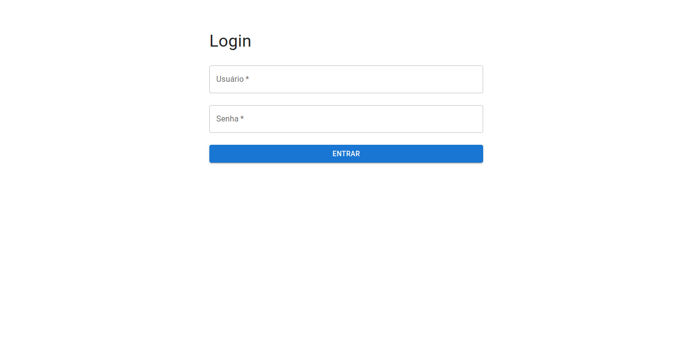

# Dashboard de Transações

Um dashboard financeiro construído com **Next.js** e **TypeScript**, que oferece funcionalidades de login, visualizações de dados interativas e filtros dinâmicos. Este projeto foi desenvolvido como parte de um desafio técnico.

## Como Funciona

A aplicação utiliza um arquivo `transactions.json` como fonte de dados, contendo informações sobre transações financeiras. Esses dados são carregados na aplicação para gerar cards de resumo e gráficos dinâmicos.

O arquivo `transactions.json` inclui os seguintes campos:

- `date`: A data da transação (em milissegundos EPOCH).
- `amount`: O valor da transação como uma string (por exemplo, "5565" representa uma transação de R$55,65).
- `transaction_type`: Indica se a transação foi uma receita (`deposit`) ou despesa (`withdraw`).
- `currency`: A moeda da transação.
- `account`: A empresa de origem ou destino da transação.
- `industry`: A categoria de indústria à qual a empresa da transação pertence.
- `state`: O estado onde a empresa da transação está incorporada.

> ⚠️ **Aviso: Para fins de desenvolvimento o acesso ao dashboard só é possível utilizando as seguintes credenciais:**
>
> - **Usuário:** `admin`
> - **Senha:** `admin`


## Funcionalidades

- **Página de Login**: Permite acesso seguro ao dashboard.
- **Dashboard Protegido**:  Usuários devem estar logados para acessar o conteúdo.
- **Filtros Dinâmicos**: Filtre transações por datas, contas, indústrias e estado. Todo o conteúdo do dashboard é atualizado automaticamente com base nos filtros aplicados.
- **Cards de Resumo**: Cards exibindo dados financeiros chave, como receitas, despesas, transações pendentes e saldo total.
- **Gráficos**: Utiliza Chart.js para criar gráficos de barras empilhadas e gráficos de linhas, permitindo a visualização clara das transações.
- **Sessão Persistente**: Dados da sessão e filtros são persistidos no Cookie do navegador.
- **Design Responsivo**: Totalmente responsivo, estilizado usando styled-components e MaterialUI.
- **Sidebar**: Sidebar exclusiva para navegação dentro do dashboard, com opções de Logout e Home.
- **Sem Necessidade de Banco de Dados**: Os dados são carregados a partir do arquivo `transactions.json` fornecido.

## Stack Tecnológico

- **Next.js** (14.2.15)
- **TypeScript**
- **Styled-components** (6.1.13)
- **MUI** para componentes de UI
- **Chart.js** para visualizações de dados
- **Vitest** para testes unitários
- **Danfo.js** para manipulação de dados

## Demonstração

A aplicação está hospedada no Vercel e pode ser acessada através do link:

🔗 **[Dashboard de Transações](https://transactions-dashboard-theta.vercel.app/)**

## Instalação

Siga estes passos para configurar e executar a aplicação localmente.

1. **Clone o repositório:**

   ```bash
   git clone https://github.com/sobucki/transactions-dashboard.git
    ```

2. **Navegue para o diretório do projeto:**

   ```bash
   cd transactions-dashboard
   ```

3. **Instale as dependências:**

   ```bash
   npm install
   ```

4. **Inicie o servidor de desenvolvimento:**

   ```bash
   npm run dev
   ```

## Testes

O projeto inclui testes unitários, para executa-los use o comando:

```bash
npm run test
```

## Screenshots

1. **Tela de login**
  
  